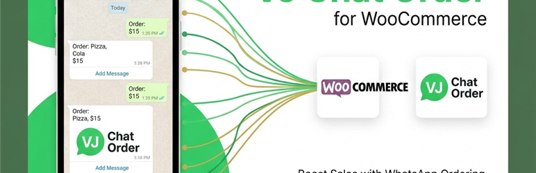
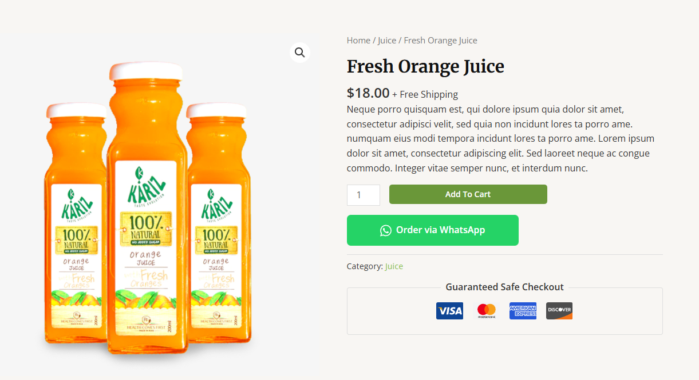
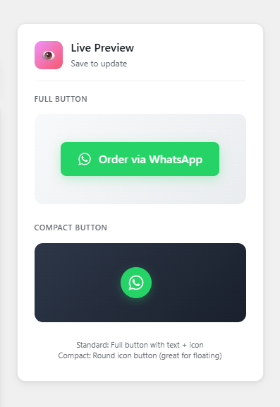
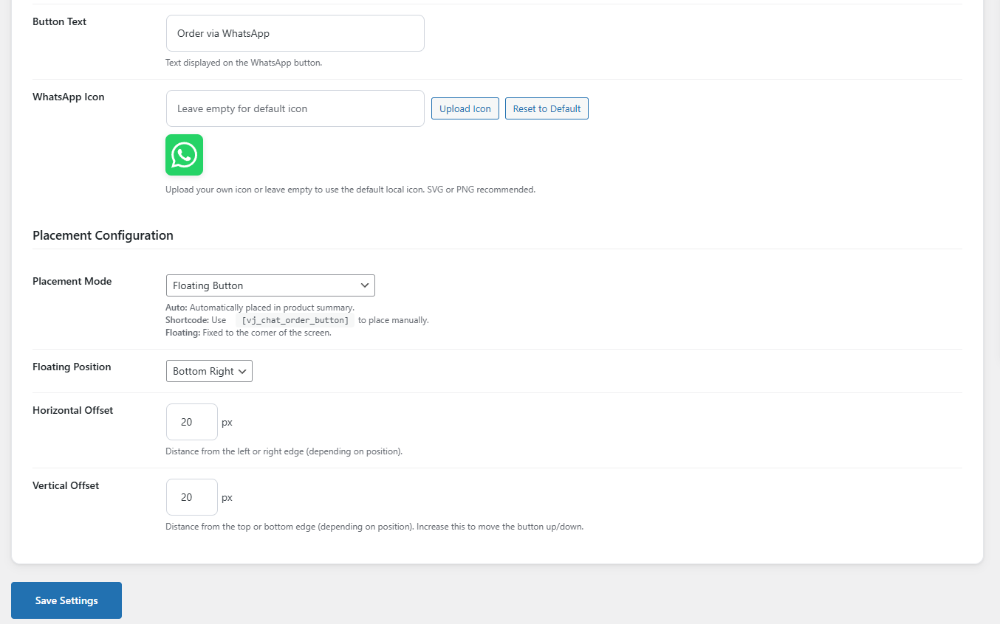
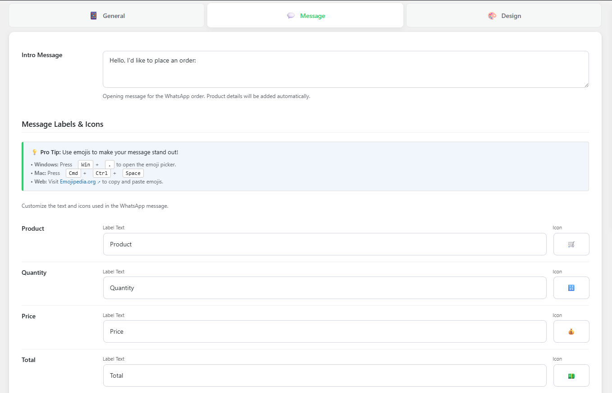
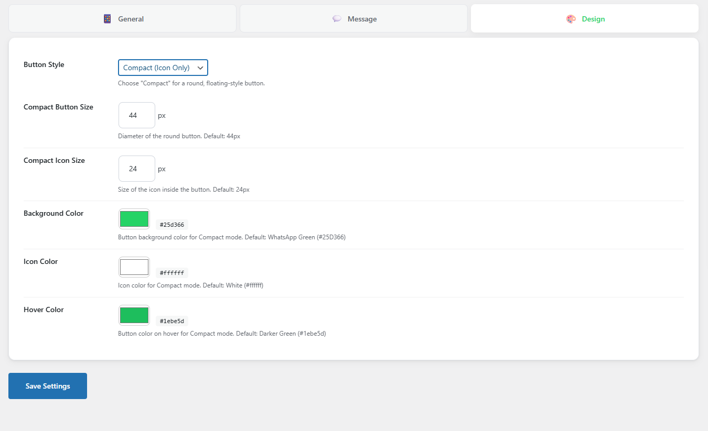
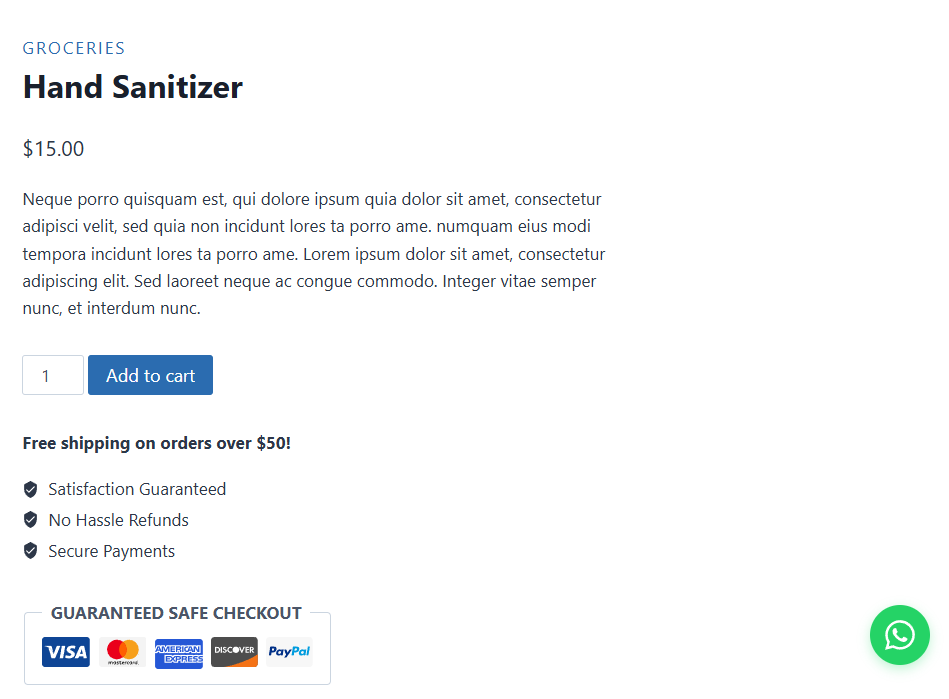

# VJ Chat Order for WooCommerce

[](https://github.com/VJ-Ranga/VJ-Chat-Order-for-WooCommerce)
[](https://www.gnu.org/licenses/gpl-2.0)
[](https://woocommerce.com/)



Adds a customizable **"Order via Chat App"** button to your WooCommerce product pages, allowing customers to send order details directly to your WhatsApp number.

---

## 🚀 Features

### Button Styles
- **Standard Button:** Full-width button with icon and text
- **Compact Button:** Circular floating icon-only button

### Placement Options
- **Auto Placement:** After Add to Cart, Before Category, or After Category
- **Floating Button:** Fixed position on screen with offset controls
- **Shortcode:** Use `[vj_chat_order_button]` anywhere

### Customization
- **Fully Customizable Message:** Change every label (Product, Price, Quantity, Total, Link)
- **Custom Icons:** Use any emoji for message lines (🛒, 💰, 🔗, etc.)
- **Live Preview:** Real-time preview in admin dashboard
- **Independent Design Settings:** Separate colors for Standard and Compact modes

### Theme Compatibility
- Works with **Astra**, **Storefront**, **OceanWP**, and all popular themes
- Reliable WooCommerce hook-based positioning

---

## 📬 Example Message

```text
Hello, I'd like to place an order:

🛒 *Product:* Men's Classic T-Shirt
🔢 *Quantity:* 2
💰 *Price:* $25.00
💵 *Total:* $50.00
🔗 *Link:* https://yourstore.com/product/t-shirt
```

---

## 📸 Screenshots

### 1. Standard Button (Frontend)


### 2. Live Preview


### 3. General Settings


### 4. Placement Configuration


### 5. Message Customization


### 6. Design Settings - Standard


### 7. Design Settings - Compact


### 8. WhatsApp Message Output


### 9. Compact Button (Frontend)


---

## 🛠️ Installation

1. Download the plugin ZIP file
2. Go to **Plugins > Add New > Upload Plugin**
3. Upload the ZIP file and click **Install Now**
4. Activate the plugin
5. Go to **Settings > VJ Chat Order** to configure

---

## ⚙️ Configuration

| Tab | Description |
|-----|-------------|
| **General** | Set your WhatsApp number, button text, and placement mode |
| **Message** | Customize intro message and labels with emojis |
| **Design** | Style Standard and Compact buttons separately |

---

## Changelog

### 2.1.0
- **NEW:** Improved button position with reliable WooCommerce hooks
- **NEW:** "After Add to Cart" works correctly with Astra and all themes
- **Fix:** Button no longer appears inline with category text

### 2.0.0
- **NEW:** Separated design settings for Standard and Compact modes
- **NEW:** Independent color customization for Compact mode
- **NEW:** Floating button with position controls
- **NEW:** Shortcode support `[vj_chat_order_button]`

### 1.4.0
- Plugin renamed to "VJ Chat Order for WooCommerce"

### 1.0.0
- Initial release

---

## 📄 License

This plugin is released under the **GPLv2** license.

---

## 🔗 Links

- **GitHub:** [VJ-Chat-Order-for-WooCommerce](https://github.com/VJ-Ranga/VJ-Chat-Order-for-WooCommerce)
- **Author:** [VJ Ranga](https://vjranga.com/)
- **Support:** [Buy Me a Coffee](https://www.buymeacoffee.com/vjranga)
