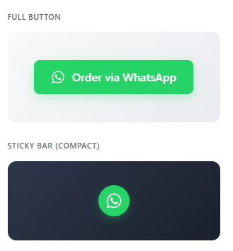
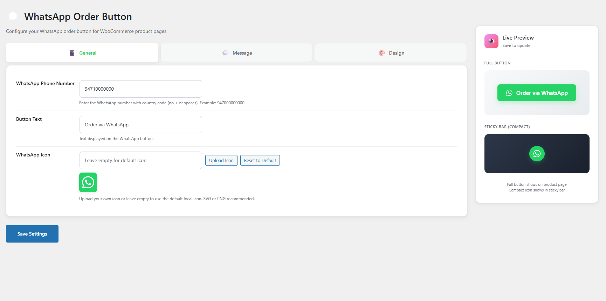
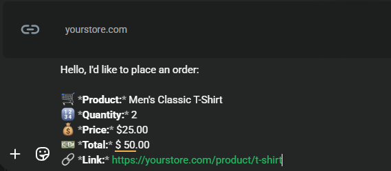

# VJ Chat Order for WooCommerce

**Stable tag:** 2.1.0  
**License:** GPLv2 or later  
**License URI:** [https://www.gnu.org/licenses/gpl-2.0.html](https://www.gnu.org/licenses/gpl-2.0.html)

By **[VJ Ranga](https://vjranga.com/)**

---

## Description

Adds a customizable **"Order via Chat App"** button to your WooCommerce product pages, allowing customers to send order details directly to your WhatsApp number.


---

## 🚀 Features

### Button Styles
- **Standard Button:** Full-width button with icon and text
- **Compact Button:** Circular floating icon-only button

### Placement Options
- **Auto Placement:** After Add to Cart, Before Category, or After Category
- **Floating Button:** Fixed position on screen (Corner positioning with offset controls)
- **Shortcode:** Use `[vj_chat_order_button]` anywhere on your site

### Customization
- **Fully Customizable Message:** Change every label (Product, Price, Quantity, Total, Link)
- **Custom Icons:** Use any emoji or text for message lines (🛒, 💰, 🔗, etc.)
- **Live Preview:** Real-time preview in the admin dashboard
- **Independent Design Settings:** Separate color schemes for Standard and Compact modes

### Smart Data Capture
- Product Name
- Price & Total Calculation
- **Selected Variations** (Size, Color, etc.)
- Product URL

### Theme Compatibility
- Works with **Astra**, **Storefront**, **OceanWP**, and all popular themes
- Reliable WooCommerce hook-based positioning

---

## 📬 Example Message

*What your customers will send to you:*

```text
Hello, I'd like to place an order:

🛒 *Product:* Men's Classic T-Shirt
🔢 *Quantity:* 2
💰 *Price:* $25.00
💵 *Total:* $50.00
🔗 *Link:* https://yourstore.com/product/t-shirt
```

---

## 📸 Screenshots

### 1. Standard Button (Frontend)
*How the standard button appears on your product page.*


### 2. Live Preview
*Real-time preview in the admin sidebar.*



### 3. General Settings
*Configure your WhatsApp number and button text.*



### 4. Placement Configuration
*Configure button placement mode and position.*


### 5. Message Customization
*Define the message content, change labels, and choose emojis.*


### 6. Design Settings - Standard Button
*Style the standard button to match your brand.*


### 7. Design Settings - Compact Button
*Configure the compact/floating button design.*


### 8. Example WhatsApp Message
*What your customers will send to you.*



### 9. Compact Button (Frontend)
*How the compact button appears on your product page.*


---

## 🛠️ Installation

1. Download the plugin ZIP file
2. Go to **Plugins > Add New > Upload Plugin**
3. Upload the ZIP file and click **Install Now**
4. Activate the plugin
5. Go to **Settings > VJ Chat Order** to configure

---

## ⚙️ Configuration

| Tab | Description |
|-----|-------------|
| **General** | Set your WhatsApp number, button text, and placement mode |
| **Message** | Customize intro message and labels with emojis |
| **Design** | Style Standard and Compact buttons separately |

---

## Changelog

### 2.1.0
- **NEW:** Improved button position setting with reliable WooCommerce hooks
- **NEW:** "After Add to Cart Button" position works correctly with Astra and all themes
- **NEW:** CSS fixes for proper button display in product meta section
- **Fix:** Button no longer appears inline with category text

### 2.0.0
- **NEW:** Completely separated design settings for Standard and Compact button modes
- **NEW:** Independent color customization for Compact mode (Background, Icon, Hover)
- **NEW:** Customizable Compact button size and icon size
- **NEW:** Floating button placement with position and offset controls
- **NEW:** Shortcode support `[vj_chat_order_button]`
- **Enhancement:** Improved admin UI with grouped design settings
- **Enhancement:** Live preview updates for all design changes

### 1.4.0
- Rename: Plugin officially renamed to "VJ Chat Order for WooCommerce"
- Performance: Optimized uninstall process

### 1.3.0
- Feature: Added Pro Tip box for using emojis
- Enhancement: Direct link to Emojipedia

### 1.2.0
- Fix: Settings saved notification issue
- Enhancement: Icon uploader improvements

### 1.0.0
- Initial release

---

## 📄 License

This plugin is released under the **GPLv2** license.

---

## 🔗 Links

- **GitHub:** [VJ-Chat-Order-for-WooCommerce](https://github.com/VJ-Ranga/VJ-Chat-Order-for-WooCommerce)
- **Author:** [VJ Ranga](https://vjranga.com/)
- **Support:** [Buy Me a Coffee](https://www.buymeacoffee.com/vjranga)
