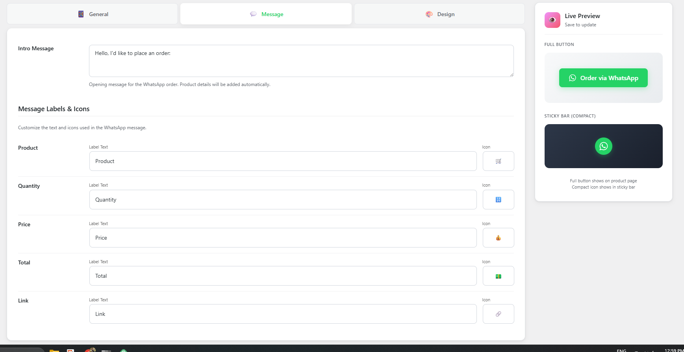

# VJ Chat Order for WooCommerce
Stable tag: 2.0.0
License: GPLv2 or later
License URI: https://www.gnu.org/licenses/gpl-2.0.html

By **VJ Ranga**

== Description ==
Adds a customizable **"Order via Chat App"** button to your WooCommerce product pages, allowing customers to send orders details directly to your WhatsApp number.

== Changelog ==

= 2.0.0 =
* NEW: Completely separated design settings for Standard and Compact button modes
* NEW: Independent color customization for Compact mode (Background, Icon, Hover)
* NEW: Customizable Compact button size and icon size
* NEW: Floating button placement with position and offset controls
* NEW: Shortcode support `[vj_chat_order_button]`
* Enhancement: Improved admin UI with grouped design settings
* Enhancement: Live preview updates for all design changes

= 1.4.0 =
* Rename: Plugin officially renamed to "VJ Chat Order for WooCommerce" (formerly WhatsApp Order Button).
* Performance: Optimized uninstall process with direct SQL deletion.

= 1.3.0 =
* Feature: Added helpful "Pro Tip" box for using emojis in message labels (Win + . / Cmd + Ctrl + Space).
* Enhancement: Added direct link to Emojipedia for finding icons.
* Enhancement: UI improvements for labels section.

= 1.2.0 =
* Fix: Solved double "Settings saved" notification issue.
* Fix: Corrected settings link slug mismatch.
* Enhancement: Added icon uploader validation and preview improvements.
* Enhancement: Added frontend data validation for stability.
* Enhancement: Optimized performance with lazy loading for admin images.

= 1.0.0 =
* Initial release.


## 🚀 Features

*   **One-Click Ordering:** Customers can order instantly without a complex checkout process.
*   **Fully Customizable Message:**
    *   Change every label (Product, Price, Quantity, Total, Link).
    *   **Custom Icons:** Use any emoji or text for message lines (🛒, 💰, 🔗, etc.).
*   **Smart Data Capture:** Automatically captures:
    *   Product Name
    *   Price & Total Calculation
    *   **Selected Variations** (Size, Color, etc.)
    *   Product URL
*   **Live Preview:** Real-time preview in the admin dashboard to see how your button looks before saving.
*   **Modern Admin UI:**
    *   Clean Tabbed Interface (General, Message, Design).
    *   Responsive Sidebar Preview.
    *   Beautiful Toast Notifications for save actions.
*   **Mobile Optimized:** The dashboard and the frontend button are fully responsive.

## 📬 Example Message
*What your customers will send to you:*

```text
Hello, I'd like to place an order:

🛒 *Product:* Men's Classic T-Shirt
🔢 *Quantity:* 2
💰 *Price:* $25.00
💵 *Total:* $ 50.00
🔗 *Link:* https://yourstore.com/product/t-shirt
```

## 📸 Screenshots

### 1. Frontend Button
*How the button appears on your product page.*


### 2. Live Preview
*Real-time preview in the admin sidebar.*


### 3. General Settings
*Configure your number and button text.*


### 4. Message Customization
*Define the message content, change labels, and choose emojis.*


### 5. Design Settings
*Style the button to match your brand.*


### 6. Example Message
*What your customers will send to you.*


## 🛠️ Installation

1.  Download the plugin folder.
2.  Upload the `vj-chat-order` folder to your `/wp-content/plugins/` directory.
3.  Activate the plugin through the 'Plugins' menu in WordPress.
4.  Go to **Settings > VJ Chat Order** to configure your number and design.

## ⚙️ Configuration

1.  **General Tab:** Set your WhatsApp number and basic button text.
2.  **Message Tab:** Customize the intro message and change labels/icons for the order details.
3.  **Design Tab:** Tweak colors, padding, and border radius to match your theme.

## 📄 License

This plugin is released under the **GPLv2** license.
